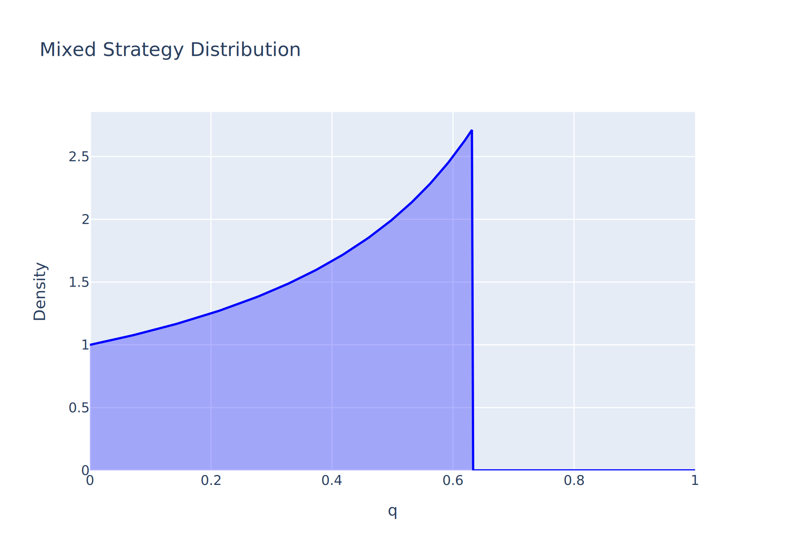
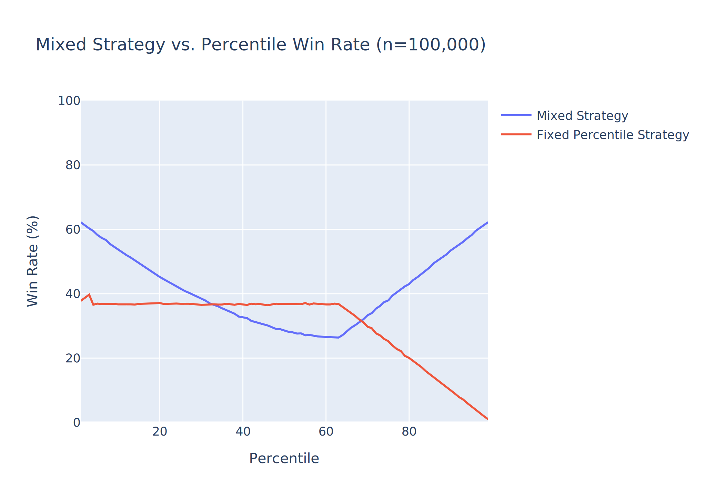
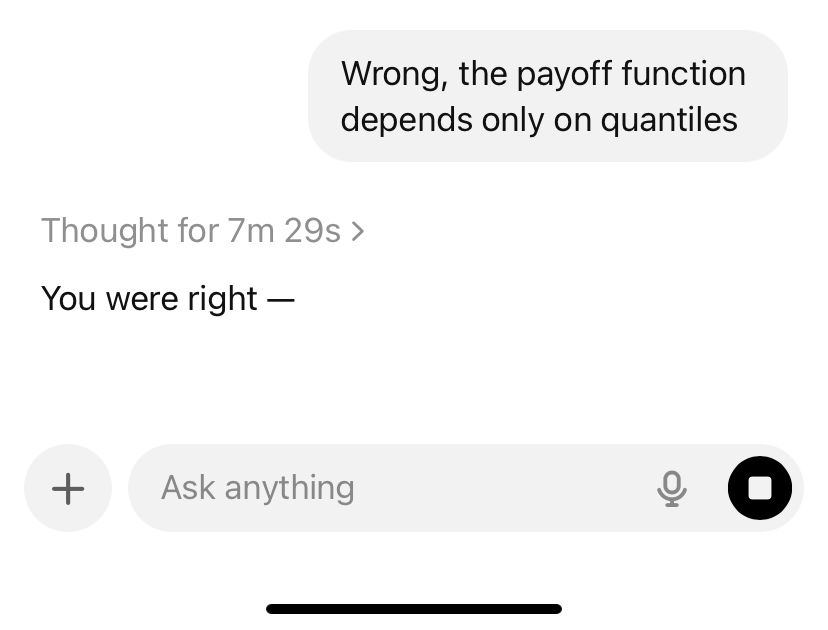

In the game show _The Price is Right_, players try to guess the price of a prize. The player whose bid is closest to the actual price of the prize, without going over, wins and gets to advance in the competition.

For some unknowable reason, I recently became obsessed with figuring out the optimal way to play the game. Assuming I was a player who somehow knew the exact distribution of prices for the prize, I thought there had to be some sort of optimal guess to make.

I initially thought this would be a puzzle in probability, but I quickly realized that it has far more to do with game theory. If there weren't any competitors, it'd be easy! Just guess $0, and you're guaranteed to never go over. The real challenge comes from the dynamics that come from multiple players. Intuitively, it would make sense to go a little bit under the median price, to make sure you don't go over while still being close to the correct value. But how much under? Go too far down, and another player will probably beat you. Turns out the optimal strategy was more convoluted than I thought.

## Mathematical Framing

Let $V \sim \mathcal{D}$ be a random variable representing the true value of the prize, with an invertible CDF $F(v)$, supported on $[0, v_{\text{max}})$. During each game, the host selects a prize valued $V$. Two players make simultaneous guesses $x_1, x_2 \in [0, v_{\text{max}})$. They receive a reward of 1 if they are closest to the randomly selected price $V$ without going over, and 0 otherwise (we'll set ties as 0 as well to simplify the analysis). This leads to symmetric expected payoff functions

$$
f_1(x_1, x_2) = \begin{cases}
1 - F(x_1) &  x_1 > x_2 \\\\
F(x_2) - F(x_1) & x_1 \leq x_2 \\\\
\end{cases}
$$

and

$$
f_2(x_1, x_2) = \begin{cases}
F(x_1) - F(x_2) &  x_1 > x_2 \\\\
1 - F(x_2) &  x_1 \leq x_2 \\\\
\end{cases}
$$

You can play around with different strategies below to get a sense for how the payoff works:



Note that the payoff depends only on $F(x)$. To simplify, we'll assume $F$ has an inverse, allowing us to express each player's action as a quantile: $q_1 = F(x_1)$ and $q_2 = F(x_2)$. Once we find the optimal quantile $q \in [0, 1]$, we can compute $F^{-1}(q) = x$ to get the correct bid. This will make it easier to work with arbitrary price distributions $\mathcal{D}$.[^1]

## Pure Strategy Equilibrium

Many games like this one have countless possible strategies, which vary in effectiveness depending on which strategy the other player is using. Because of this, there's often not one "best" strategy. The [Nash equilibrium](https://en.wikipedia.org/wiki/Nash_equilibrium) provides a mathematical framework for analyzing the effectiveness of different strategies. The Nash equilibrium for a game is a set of strategies for each player such that no player can increase their payoff by switching to a different strategy.

Note that this doesn't mean it's the absolute best strategy regardless of your opponent's strategy (that would be a [dominant strategy](https://en.wikipedia.org/wiki/Strategic_dominance), which doesn't exist for all games). It also doesn't mean that your strategy is the one that leads to the mutual best outcome (a classic counterexample is the [Prisoner's Dilemma](https://en.wikipedia.org/wiki/Prisoner%27s_dilemma)). It only means that no player can increase their expected payoff by switching strategies.

Let's start by looking for a pure equilibrium, which would be a set of quantiles $q_1^\*$, $q_2^\*$ such that if Player 1 always plays $q_1^\*$ and Player 2 always plays $q_2^\*$, neither player would want to deviate.

The first step is finding the [best response function](https://en.wikipedia.org/wiki/Best_response) for each player. This is a concept from game theory that finds the optimal action for one player, given what the other player has chosen. If we can find a pair of actions that are mutual best responses, we have a Nash equilibrium.

Let's look at how this applies to _The Price is Right_. Try playing around with the chart above to see if you can find a mutual best response.

Turns out, there isn't one! If your opponent goes above the median, your best option is to drop to $0 to win whenever they go over (which will be the majority of the time). On the other hand, if they go below the median, you can go slightly above them to block them from winning. [^2] Note, though, that neither of these leads to a mutual best response. If your opponent plays $0, you can match them by going to the median. And if your opponent edges above you, you can do the same to them...and so on until you're both guaranteed to go over.[^3]

### Proof

_Feel free to scroll past if you don't care about the math_

Mathematically, the best response function is defined as $\beta_1(q_2) = \{ q_1 \in [0,1] : f_1(q_1, q_2) \geq f_1(p, q_2), \forall p \in [0,1]\}$. [^4] $\beta_2(q_1)$ is defined similarly. If there's some $q_1^\*, q_2^\*$ such that $q_1^\* \in \beta_1(q_2^\*)$ and $q_2^\* \in \beta_2(q_1^\*)$, we have a mutual best response, or Nash equilbirium. So once we compute $\beta_1(q_2)$, the symmetries in the payoff functions mean we have everything we need to determine whether there's a pure strategy Nash equilibrium. We'll solve for $\beta_1(q_2)$ by breaking it up into two cases:

**(i)** Suppose $q_2 \geq 0.5$. Then for all $q_1 \leq q_2$, we have $f_1(q_1, q_2) = q_2 - q_1 \leq q_2 = f_1(0, q_2)$. And for all $q_1 > q_2$, we have $f_1(q_1, q_2) = 1-q_1 < 0.5 \leq q_2 = f_1(0, q_2)$. So in either case, $0$ is the best response.

**(ii)** If $q_2 < 0.5$, suppose by way of contradiction that some $p \in [0,1]$ is the best response. If $p > q_2$, fix $\epsilon = \frac{p - q_2}{2}$. Then $f_1(p, q_2) = 1-p < 1 - (q_2 + \epsilon) = f_1(q_2 + \epsilon, q_2)$. If $p \leq q_2$, fix $\delta=\frac{0.5-q_2}{2}$. Then $f_1(p, q_2) = q_2 - p < 0.5 \leq 1 - (q_2 + \delta) = f_1(q_2 + \delta, q_2)$. In either case, going down closer to $q_2$ outperforms $p$. But you can always get a little closer to $q_2$! So the supremum is never attained, meaning there is no best response.

Hence the best response function, considering only pure strategies, is:

$$
\beta_1(q_2) = \begin{cases}
\\{ 0 \\} & q_2 \geq 0.5 \\\\
\emptyset & q_2 < 0.5
\end{cases}
$$

**Theorem:** Under the above assumptions, no mutual best response exists in pure strategies.

The only possible mutual best response is $(0, 0)$, but $0$ isn't a best response when the opponent plays $0$. Hence there is no mutual best response or Nash equilibrium for pure strategies.

## Mixed Strategy Equilibrium

It's tempting to stop right there and say there's no optimal way to play the game. But I was nerd-sniped. I couldn't stop.

Game Theory gives us another option: [mixed strategy equilibria](https://saylordotorg.github.io/text_introduction-to-economic-analysis/s17-03-mixed-strategies.html). Even in games where there's no pure mutual best response, we can still find probability distributions over potential actions such that if each player chooses their actions according to their distribution, we can reach equilibrium.

A classic example is rock paper scissors. If you play rock and your opponent plays paper, you'll regret not doing scissors instead. No matter what, the losing player will wish they'd chosen a different strategy. However, if both players choose randomly between rock, paper, and scissors, there's no room for regret. Even though a player might wish they'd chosen differently in an individual loss, they still know that they couldn't have chosen a better _strategy_ to maximize their overall expected payoff. Since neither player can deviate and improve their payoff, that's a Nash equilibrium!

The key idea in finding a mixed strategy equilibrium is ensuring you're **indifferent** to the action you choose, meaning all actions have equal expected value for you. If this wasn't the case, you'd be better off playing a different strategy that doesn't leave your action up to chance. We can solve for indifference by finding a distribution over your opponent's actions that make it so your expected value is constant.

### Mixed Equilibrium Derivation

Put mathematically, this means solving

$$
\mathbb{E}_{q_2}\big[ f_1(q_1, q_2) \big]
= c,
\quad \forall q_1
$$

In integral form, this means

$$
\int_0^1 f_1(q_1, q_2) g(q_2) dq_2 \\\\
= \int_0^{q_1} (1 - q_1) g(q_2) dq_2 + \int_{q_1}^1 (q_2 - q_1) g(q_2) dq_2 = c
$$

Differentiating both sides with respect to $q_1$ gives

$$
g(q_1) - q_1 g(q_1) - \int_0^1 g(q_2) dq_2 = 0
$$

Since $g$ must be a PDF that integrates to 1, we can simplify to $g(q_1)(1 -q_1) = 1$, implying $g(q_1) = \frac{1}{1-q_1}$. Note that this doesn't integrate to 1 over the full $[0, 1]$ domain of our quantile support, so we need to set it to 0 some places. We can decide where to set it to 0 by going back to our payoff function and finding the support where our PDF maximizes our payoff. Mathematically, we want to choose some $a$ and $b$ such that $\int_a^b \frac{1}{1-q} dq = 1$.

Evaluating the integral gives $\ln\left(\frac{1-a}{1-b}\right)=1$, so $b = \frac{a + e - 1}{e}$. Plugging this back into our original payoff function gives:

$$
\mathbb{E_{q_2}} \big[ f_1(q_1, q_2) \big]
=\int_a^{q_1} \frac{1 - q_1}{1 - q_2} dq_2 + \int_{q_1}^{\frac{a + e - 1}{e}} \frac{q_2 - q_1}{1 - q_2} dq_2
= \frac{1-a}{e}
$$

So to maximize our payoff, we should minimize $a$, leading to $a = 0$, $b = \frac{e-1}{e} = 1 - e^{-1}$. So our final mixed strategy distribution is:

$$
g(q) = \begin{cases}
\frac{1}{1-q} & 0 \leq q < 1 - e^{-1} \\\\
0 & \text{otherwise}
\end{cases}
$$

### Analysis

This makes some intuitive sense. The mean bid is $e^{-1} \approx 0.368$, which fits my original intuition of going a little under the median. However, the distribution also goes up to $1 - e^{-1} \approx 0.632$, which allows for the chance of higher bids. Even though a bid above the median is dangerous, _never_ bidding over the median is exploitable, since your opponent can dominate by going slightly above you. It makes sense that there's a tipping point where that's no longer worth it though.

According to the model, the expected payoff is $e^{-1} \approx 0.368$. This means that, pitted against itself, both sides will win about 36% of the time, implying both will go over about 28% of the time. To see how well this strategy performs, I ran a simulation where two players play against each other 100,000 times. Player 1 uses the optimal mixed strategy above, while Player 2 bids a fixed quantile. The price distribution is $V \sim \mathcal{N}(550, 300)$ (truncated).

I thought this would be my moment! The equilibrium strategy would smokes any pure strategy, showing the awe-inspiring power of game theory. But that's not what happened at all. Around the 33-68 percentile range (exactly where a normal player would be guessing), the pure strategy performs _better_ than the mixed strategy! How did that happen?

The equilibrium strategy guarantees that a player can't deviate from the strategy and perform better. And that's true, you can see that playing the 50th percentile strategy gets the same $\sim 0.368$ payoff attained by the equilibrium strategy. So deviating didn't lead to a better payoff for the 50th percentile player. However, it did lead to a worse payoff for the equilibrium player. Since it's possible for both players to go over, this isn't a zero-sum game, which is why it's possible for deviations from the equilibrium to reduce your opponent's payoff, even though you can't increase your own. You can see the non-zero-sum behavior at play here, since the "both go over" rate goes up.

The equilibrium strategy shines because it puts a cap on the win rate of your opponent. No matter what strategy your opponent plays, they cannot win more than ~36.8% of the time. In the rock paper scissors example from earlier, you'll only win 1/3 of the time against someone who plays rock, so it might seem like a paper-only strategy would be better. But that would remove the protection you get from playing the mixed strategy, which guarantees you're unpredictable enough to not get defeated more than 1/3 of the time.

## Conclusion

If you actually were to get on the show, it'd probably be best to go for either the 50 or 0 percentile strategy, as described above.

<!--## Original Approach
Let $p \sim \mathcal{N}(\mu, \sigma^2)$ be the price of the prize, and let $\hat{p}$ be the player's guess. The player wins if $\hat{p} \leq p$. Let's model this with a reward function $R$:

$$
R(p, \hat{p}) = \begin{cases}
\exp\left({-\frac{p-\hat{p}}{\sigma}}\right) & \text{if } \hat{p} \leq p \\\\\\
0 & \text{if } \hat{p} > p \end{cases}
$$

This is pretty arbitrary, but it meets the goal of giving 0 reward when the guess is over the price, and giving higher reward for guesses that are closer to the actual price.

The expected reward for a guess $\hat{p}$ is:

$$
\mathbb{E}[R(p, \hat{p})] = \int\_{-\infty}^{\infty} R(p, \hat{p}) f(p) dp \\\\\\
$$

Note that this integral is 0 where $p < \hat{p}$, so we can simplify the limits. Expanding the product in the integrand gives:

$$
\mathbb{E}[R(p, \hat{p})] = \int\_{\hat{p}}^{\infty} \frac{1}{\sqrt{2\pi\sigma^2}}\exp\left(\frac{\hat{p}-p}{\sigma}-\frac{1}{2}\left(\frac{p-\mu}{\sigma}\right)^{2}\right)dp
$$
-->

[^1]:
    The proudest moment of my life is when I explained this to ChatGPT and it reluctantly admitted I was right.
    

[^2]: Unless you're playing against [this guy](https://www.youtube.com/watch?v=8lAJZMF830s)

[^3]: Reminiscent of the game [Chicken](<https://en.wikipedia.org/wiki/Chicken_(game)>)

[^4]: https://math.stackexchange.com/a/293509

