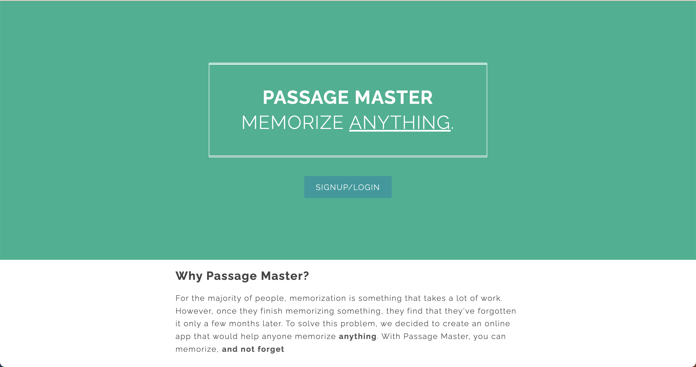
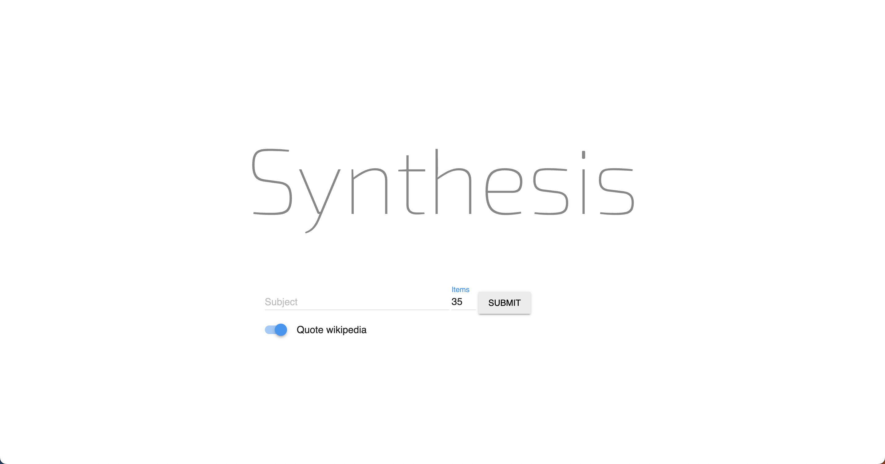
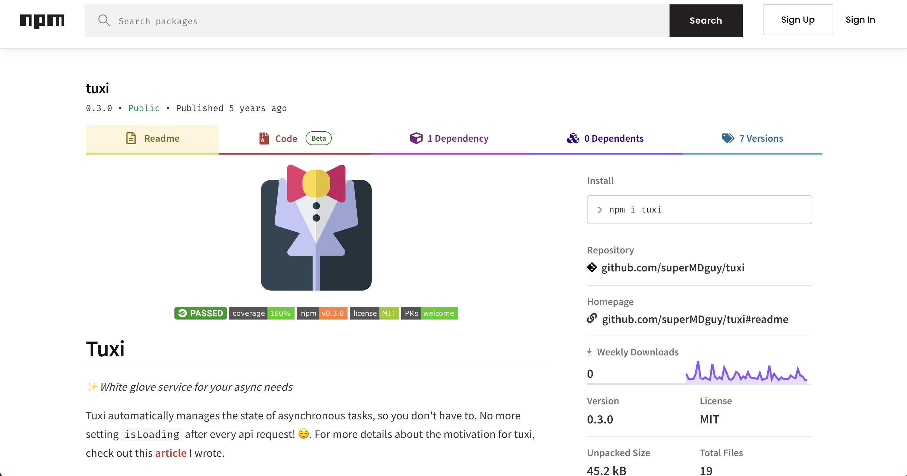
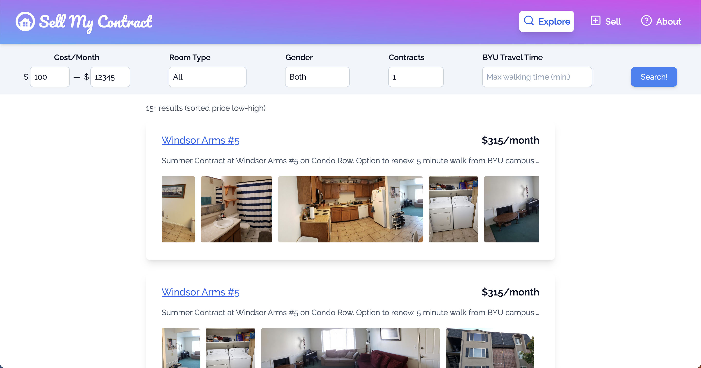
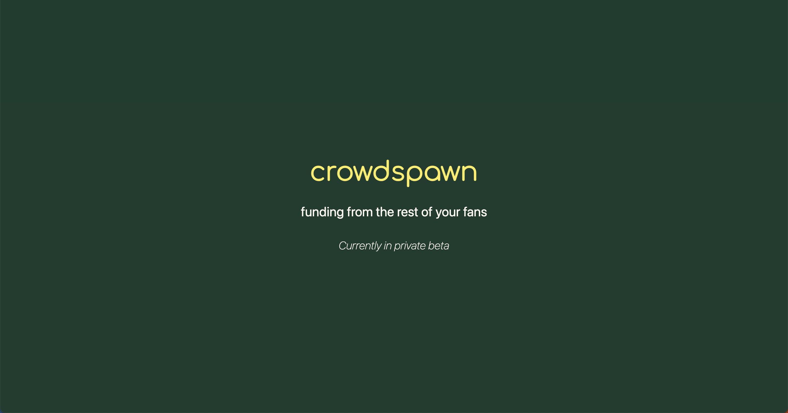
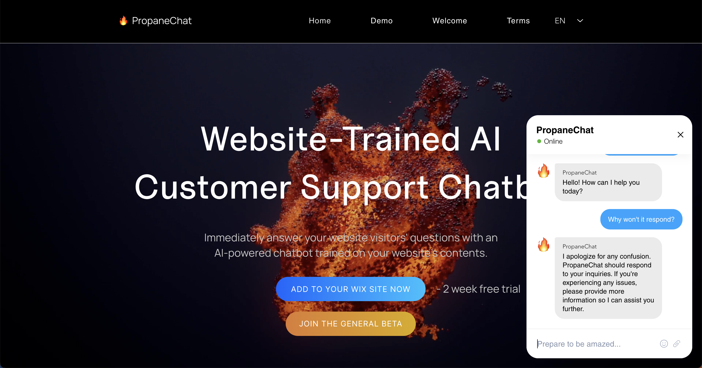
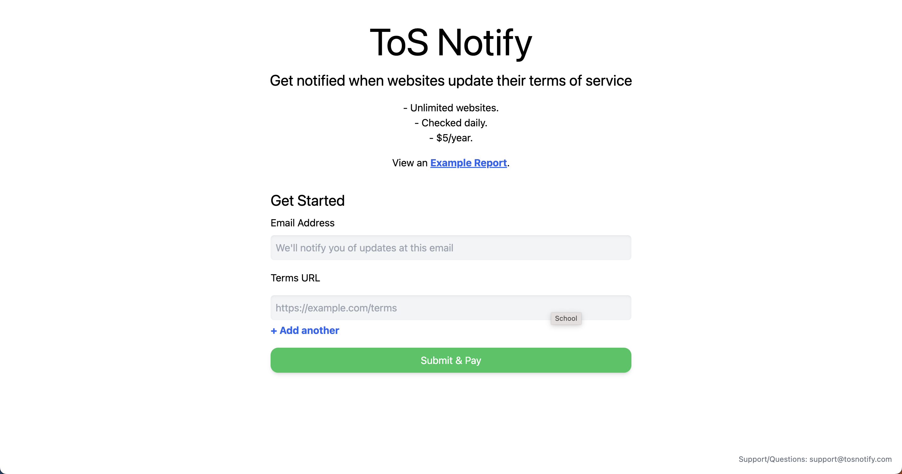

I have a lot of ideas. Some are decent, most are bad. I've started working on many of them, driven by the thrill of watching a dream take shape. I don't finish most of what I start. Calling something "finished" and then offering it to the world takes guts. And I've never built something that's fulfilled my original dream. Ideas may be perfect, but their embodiment will always fall short.

But so what! Every (imperfect, flawed) launch is a success story.

## PassageMaster - February 2017

_https://passagemaster.com_

- [Repo](https://github.com/superMDguy/passage-master)

First website I ever created! Reached out to a homeschooling website to ask about promotion, but they didn't like the landing page. My family used it a lot though!

## Synthesis - February 2017

_https://synthesis2.herokuapp.com_

- [Repo](https://github.com/superMDguy/synthesis)
- [Show HN](https://news.ycombinator.com/item?id=13767474)

I had a lot of fun with this project, and it's cool to see how it's become a reality with tools like the new Bing and Bard. I don't think anyone ever used it.

## Tuxi - Ocotober 2018

_https://www.npmjs.com/package/tuxi_

- [Article](https://medium.com/hackernoon/a-solution-to-async-boilerplate-in-javascript-2fa717801c3b)
- [Show HN](https://news.ycombinator.com/item?id=18198598)
- [Repo](https://github.com/superMDguy/tuxi)

This solved a pain point I still experience: correctly handling async data takes a lot of boilerplate. Abstractions are expensive though, and even I don't use it. Maybe I'll come back to it another day.

## SellMyContract - June 2022

_https://sellmycontract.co_

- [Reddit](https://www.reddit.com/r/byu/comments/vbt8jf/new_housing_contract_marketplace_please_tear_it/)
- [Tweet](https://twitter.com/superMDguy/status/1535783262630469633)

Summer of 2022 was the summer I was going to finally start a business that earned money. I put a lot of work into SellMyContract, and ended up getting around 30 hits/month, mostly from Google. The idea resonated with a lot of people, but scaling a marketplace app is hard and I wasn't ready to put in the effort with marketing. I made some great connections though, and experienced a lot of good "first". I also made $75!

## Crowdspawn - September 2022

_https://crowdspawn.com_

This was the first site I worked on with a cofounder. Building on what I learned from SellMyContract, I focused on validating this idea as much as I could. We ended up getting a call with an agency that managed multiple creators with millions of subscribers, which was exciting! However, we realized how much we needed to learn about the industry and gradually lost interest.

## PropaneChat - May 2023

_https://propanechat.com_

This is my biggest success so far! I worked with a cofounder, built in a marketplace, and had a couple of early beta testers who helped validate the idea. Still working on conversions and profitability, but we have over 100 users, significantly more than any of my other projects.

## ToSNotify - August 2023

_https://tosnotify.com_

- [Show HN](https://news.ycombinator.com/item?id=37064152)
- [Tweet](https://twitter.com/superMDguy/status/1689298571110350848)

I built ToSNotify in 2.5 hours on a whim. Building this was a culmination of learning a lot about validation, MVPs, and the philosophy of failing fast. I got a lot of great feedback, and also made $5! It helped me continue to build my intuition on the types of businesses that will work the best.
